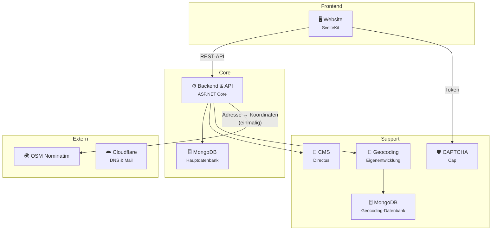

# Technische Architektur

Das Trans\*DB-Projekt ist nicht nur eine einzelne Applikation, sondern ein Zusammenspiel aus verschiedenen Services. Dabei versuchen wir, so weit wie praktikabel auf Open Source und selbstgehostete Dienste zurückzugreifen.

---

## Eigene Services

Dies sind die Services und Software, die wir selbst entwickelt oder auf unseren Servern laufen lassen. Sie sind direkt Teil der Trans\*DB-Applikation als Ganzes.

### Website

Die Webseite stellt das Frontend dar – das, womit die Nutzer:innen mit Trans\*DB interagieren.

Entwickelt mit dem [SvelteKit](https://svelte.dev/)-Web- und Frontend-Framework.

[GitHub-Repo: TransDB-de/website](https://github.com/TransDB-de/website)

### Backend

Das Backend und die API sind der Kern der Architektur. Hier werden alle Anfragen der Webseite über eine REST-API verarbeitet. Das Backend ist hauptverantwortlich für das Speichern, Verwalten und Bereitstellen der eigentlichen Einträge auf der Webseite.

Geschrieben in [ASP.NET Core](https://dotnet.microsoft.com/en-us/apps/aspnet) mit C#.

[GitHub-Repo: TransDB-de/backend](https://github.com/TransDB-de/backend)

### CMS

Das CMS dient als Unterstützung für alle Verwaltungsangelegenheiten.

Jedes Mal, wenn eine Meldung eingeht oder ein neuer Eintrag eingereicht wird, landet dies als Ticket in einem Kanban-Board im CMS. Die Moderation des Projektes lässt sich hier einfach verwalten. Außerdem werden die Admin- und Verwaltungs-Nutzer:innen hier verwaltet.

Wir verwenden dafür eine selbstgehostete Instanz von [Directus](https://directus.com/).

### CAPTCHA

Der CAPTCHA-Service dient zur Verifizierung, dass Anfragen von der Webseite an das Backend tatsächlich legitim sind. Er stellt ein erhebliches Hindernis für die automatisierte Verarbeitung und Nutzung der API dar.

Eine Erklärung, warum das wichtig ist: [CAPTCHA-Verwendung](captcha-verwendung.md)

Zum Einsatz kommt eine selbstgehostete Instanz von [Cap](https://trycap.dev/).

### Geocoding

Das Geocoding ist ein wichtiger Bestandteil der Kernfunktionalität. Es wandelt Orte in Koordinaten und Koordinaten in Orte um.

Um Einträge nicht nach Stadt zu filtern, sondern aufsteigend nach Entfernung zu sortieren, ist so ein Service notwendig. Eine selbst entwickelte Software mit ASP.NET Core implementiert genau das für unseren Use-Case.

Basierend auf Daten vom [GeoNames](https://www.geonames.org/)-Projekt stellt es dem Backend diese Funktionalität zur Verfügung.

[GitHub-Repo: TransDB-de/geocoding](https://github.com/TransDB-de/geocoding)

Da wir hier viele Suchanfragen von Nutzer:innen bearbeiten, kam ein externer Dienst sowohl aus Datenschutzgründen als auch wegen Performance und Rate-Limits nicht in Frage.

Die Genauigkeit ist hierbei aus Aufwands- und Performancegründen auf Orte und Stadtteile begrenzt. Exakte Adressen können hiermit nicht geocodet werden. Für unseren Anwendungszweck reicht das aber vollkommen.

### MongoDB

[MongoDB](https://www.mongodb.com/) ist eine dokumentenbasierte Datenbank, die besonders gut für große Datenmengen und dynamische Datensätze geeignet ist. Wir hosten die Datenbanken selbst auf unseren Servern.

Trans\*DB nutzt **zwei separate MongoDB-Instanzen**:

| Instanz | Genutzt von | Enthält |
|---|---|---|
| **Hauptdatenbank** | Backend | Einträge, Aktivitätenverlauf des Backends |
| **Geocoding-Datenbank** | Geocoding-Service | GeoNames-Ortsdaten, Postleitzahlen, Koordinaten |

## Externe Abhängigkeiten

Ganz ohne externe Dienste kommen wir leider doch nicht aus.

### OpenStreetMaps

Die [Nominatim-API](https://nominatim.org/) von OpenStreetMaps verwenden wir, um einmalig beim Einreichen eines Eintrags die Adresse in genaue Koordinaten umzuwandeln. Unser eigener Geocoding-Service ist dafür zu ungenau.

### Cloudflare

Für DNS und Mail-Weiterleitungen verwenden wir [Cloudflare](https://www.cloudflare.com/de-de/). Perspektivisch wollen wir das jedoch zu einem europäischen Anbieter umziehen.

### GitHub

Auf GitHub liegen alle Repositories der von uns geschriebenen Software.

[Organisation: github.com/TransDB-de](https://github.com/TransDB-de)